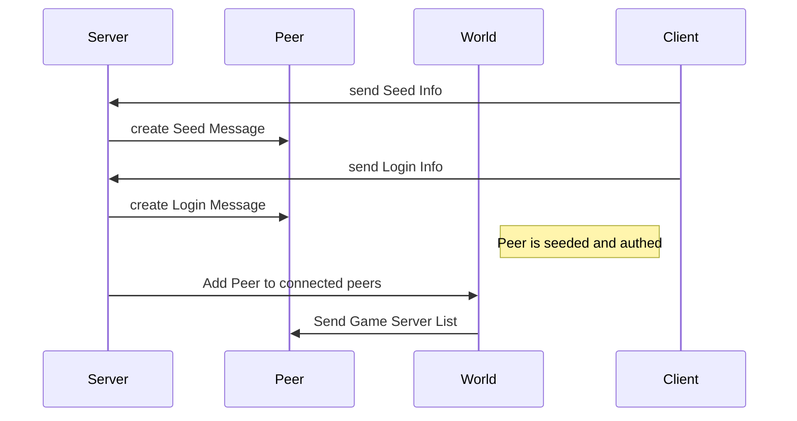

# Packet Flow

The sequence diagram below shows the start of the game packet and message flow

```mermaid
sequenceDiagram
    participant Server
    participant Peer
    participant World
    participant Client

    Client ->> Server: send Seed Info
    Server ->> Peer: create Seed Message
    Client ->> Server: send Login Info
    Server ->> Peer: create Login Message
    Note right of World: Peer is seeded and authed
    Server ->> World: Add Peer to connected peers
    World ->> Peer: Send Game Server List

```